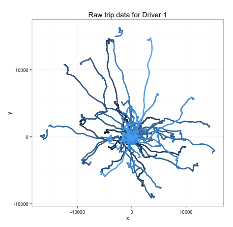
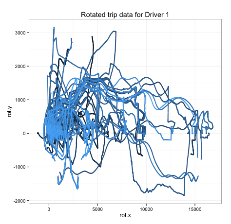
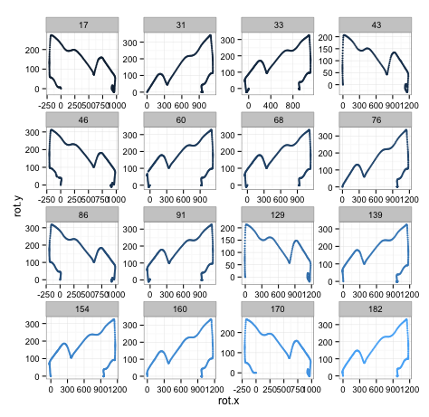

```{r,eval=F,echo=FALSE}
setwd("~/GitHub/NYCDSA_B001/project/kaggle/axa/alexadler")
```

I'm proud to say I was part of the NYCDSA Bootcamp Team, Vivi's Angels, for the [AXA Telematics Kaggle competition](https://www.kaggle.com/c/axa-driver-telematics-analysis). Now that the competition is over and the scores have been tallied, we are all learning so much from those who have started to share their approaches to solving the problem of identifying the primary owner of a car merely from the x-y data of the trip he or she took.

While no one over at the bootcamp is walking away with the $30,000 prize money, we do want to share our approach and code to such an intriguing and fun challenge. I was part of the feature engineering team and spent most of my time developing the trip-matching feature for use by my team in its models. This post will discuss how (and why) I tried to get this feature up and running.

Early in the competition, we came across posts like [this one](https://www.kaggle.com/c/axa-driver-telematics-analysis/forums/t/12321/python-code-to-automatically-draw-repeated-trips) that spoke of the success of trip matching in improving model results. Some domain experts even posted in the forums, saying that in the real world, GPS data was the best indicator of whether a driver was the owner of the car or not. The problem was that AXA rotated and flipped some trips so that they couldn't be matched in this way! The first order of business was to re-align the trips, then compare them to one another to test for matches.

Once the team decided that trip matching should be incorporated into the features of our model, there were three challenges:

* Translating the approach from Python to R
* Optimizing computational time (the original codes took days to run on multiple cores)
* Finding the best way to implement the data as a feature
  
# Coding for Trip Matching
This code was written in R to do two things:

* Rotate/flip trips so that most of the trip was in the first quadrant.
* Compare trips of roughly similar shape using euclidean distance.

With 200 trips to compare for each of 2700 drivers, parallelization was a must. `library(doParallel)` enabled the use of `foreach` loops that greatly sped up computation, even on only three cores. The flag, `.combine=rbind` takes the output from each loop and rbinds it to the dataframe in a `do.call` manner. Note that the trips for each driver have already been combined and saved as binary files before this point.
```{r, eval=FALSE}
library(dplyr)
library(doParallel)
cl <- makeCluster(1)
registerDoParallel(cores=3)

dataDir <- "data/"
drivers <- list.files(dataDir)

similarTrips<-foreach(driver=drivers,.combine=rbind) %dopar%{
  # Each driver's 200 trips were loaded as a binary file before being compared with one another
  load(paste0(dataDir,driver))
  driverID<-gsub(driver,pattern="DriverData",replacement="")
```

## Rotating/flipping trips
Before the comparison for loops, transformations were applied via `mutate()` in the `dplyr` package. These transformations rotate each trip so that the last point is on the positive x-axis by changing the coordinate system. The trips were then flipped if more than half of the x or y coordinates were negative. This was useful later when trips were compared roughly before calculating their euclidean distances. When the euclidean distances were calculated, the rotated y values were used.
```{r, eval=FALSE}
  test<-drives %>%
    group_by(tripID) %>%
    mutate(x = x, y = y,
           r=sqrt(x^2+y^2),
           alpha=atan2(last(y),last(x))-atan2(y,x),
           rot.x=r*cos(alpha),
           rot.y=r*sin(alpha),
           rows=n(),
           rot.x.flip=ifelse(sum(rot.x<0)>floor(rows/2), -rot.x, rot.x),
           rot.y.flip=ifelse(sum(rot.y<0)>floor(rows/2), -rot.y, rot.y)
    )%>%
    select(tripID,rot.x=rot.x.flip,rot.y=rot.y.flip)
```

To give a visual idea of this rotation, **Figure 1** and **Figure 2** show the raw and rotated trips, respectively.

<table border="0" cellpadding="0">
<tr>
<td width=400>

<br />
**Fig 1.** - The 200 raw trips for Driver 1, colored by trip ID.
</td>

<td width=400>

<br />
**Fig 2.** - The trips have now been rotated and flipped.
</td>
</tr>
</table>

Even at this point, the naked eye can see *some* similarity among the rotated, spaghetti-esque mess. The next steps will automate the trip comparison to ultimately reveal similarities among trips.

## Comparing individual trips
Only unique pairs of trips were considered, greatly reducing computational time.
```{r,eval=FALSE}
  mini2<-NULL
  # begin a nested loop to check all UNIQUE combinations of trips
  for(i in 1:199){
    focus<-select(test[test$tripID==i,], foc.x=rot.x, foc.y=rot.y)
    mini1<-NULL
    for(k in (i+1):200) {
      compare<-select(test[test$tripID==k,], cmp.x=rot.x, cmp.y=rot.y)
```

Once two trips were selected for potential comparison, their "footprint" was compared. Trips that were more than 20% different in x- or y- range were not compared, since that large a difference would probably indicate a poor match. This selection by if statements **reduced computational time by over 30%** over checking every pair, generally resulting in approximately 1000 comparisons.
```{r,eval=FALSE}      
      if(!(diff(range(focus$foc.x))<0.8*diff(range(compare$cmp.x))) &
           !(diff(range(compare$cmp.x))<0.8*diff(range(focus$foc.x))) &
           !(diff(range(focus$foc.y))<0.8*diff(range(compare$cmp.y))) &
           !(diff(range(compare$cmp.y))<0.8*diff(range(focus$foc.y)))
      ){
```

In order to compare trips by their euclidean distance, their vectors must be the same length. The forum post that inspired this post *imputed* extra values by repeating values from the shorter of the two trips. Initially, that was my approach; however, it was faster (by about 10%) and more conservative (no imputed values) to *truncate* the longer of the two vectors.
```{r,eval=FALSE}
        trimLength<- min(nrow(compare),nrow(focus))
        focusTrim<-focus[1:trimLength,]
        compareTrim<-compare[1:trimLength,]
```

Finally, the euclidean distance was calculated between the `focusTrim` and `compareTrim` y-values. I had to apply a normalization in order for the euclidean distance to be an acurate metric for similarity of trips of all sizes. Without such a normalization, trips with larger y- values would have greater euclidean distance, even if they were just as good a match. I chose to normalize by the mean of the largest y-values from each of the two trips.
```{r,eval=FALSE}
        eqDistMat<-rbind(focusTrim$foc.y,compareTrim$cmp.y)
        mini1<-rbind(mini1,
                     data.frame(driver=driverID, tripA=i,tripB=k,
                   eucDist=unlist(as.numeric(dist(eqDistMat)))/mean(c(max(focusTrim$foc.y),max(compareTrim$cmp.y)))
                  ))
      } # end if loop
    } # end comparison loop
    mini2<-rbind(mini2,mini1)
  } # end focus loop
  mini2
}
```

## Visualizing the result
Arranging the output (`similarTrips`) by `eucDist`, we get a "rank" of trip similarity, with the most similar trips towards the top. Keep in mind that `eucDist` doesn't hold much value, but serves to indicate which trips are relatively similar.
```{r, eval=FALSE}
> head(arrange(similarTrips,eucDist),n=10)
   driver tripA tripB   eucDist
1       1    76   182 0.6139725
2       1    46    86 0.7146952
3       1    33    68 0.8082965
4       1   139   160 0.8460641
5       1    60    68 0.9580528
6       1    31   160 1.0072537
7       1    17   170 1.0351923
8       1    68   154 1.0593948
9       1    33    91 1.0752706
10      1    43   129 1.1583642
```

After looking at the spaghetti plot (Fig. 1) for so long, plotting the unique trips from the `tripA` and `tripB` column produces a gratifyingly organized verification of some success in matching trips:

<table border="0" cellpadding="0">
<tr>
<td width=400>

<br />
**Fig 3.** - Unique (rotated) trips in the top 10 pairs of matched trips for Driver 1, faceted by trip ID.
</td>
</table>
<br>

Our team now had a trip matching algorithm of our own (written in R instead of Python), and it was relatively fast at about 50 seconds per driver per cpu (about 38 cpu hours for the whole set). 

### Which `eucDist` should we choose?
This was not an easy question to answer. Choosing several drivers at random and plotting the above facets along with the ranked list of `eucDist` values. Our thinking was to be conservative: it was better to miss a true positive than to introduce false positives by choosing a threshold that was too high. Eventually, we chose a threshold such that approximately 30 pairs were nearly all true positives. Later we would see that it wasn't about finding pure matches.

If all of this manual verification sounds like it was mindnumbing, don't worry: the monotony of verifying a few of these top matches for several drivers was outweighed by the sheer joy of finding order amidst the chaos. 

# Trip matches as features
Now that we could get a rough idea of which trips were similar, we needed to somehow code these trips for our gradient boosting machines model. We kicked around a lot of ideas:

**Maybe any trip that matches another trip is the primary owner.**

This turned out to produce bad results. Intuitively, we should have realized that even non-owners of the vehicles might take the same routes from time to time.

**Maybe trips that have a match should "round" our initial prediction to 0 or 1.**

Again, this reduced our performance on the public leaderboard. Although it would have been so nice to apply such a manual post-processing boost to our predictions!

**Maybe trips should receive a score based on their similarity at different `eucDist` thresholds.**

This was what ultimately produced an improvement in our public leaderboard score. I chose 5 thresholds, ranging from very conservative to very lax and assigned scores to them such that trips that matched at conservative thresholds (and more lax ones as a result) received a higher score than those that only matched at the "liberal thresholds."

# A Happy Ending
We had a blast in our first-ever Kaggle competition, finally able to edge our way into the top 10%. More importantly, we learned a **TON** about team organization and workflow. Admittedly, the trip matching algorithm was successful weeks before its results could be turned into useful predictors. This is where having a great team helped. Conversations over coffee or lunch often produced new insights. I was lucky to be part of such a dedicated and hard-working team.

